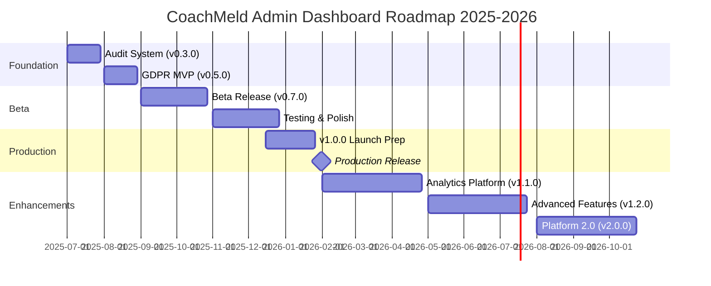
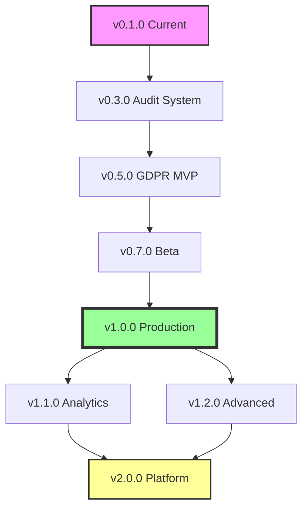
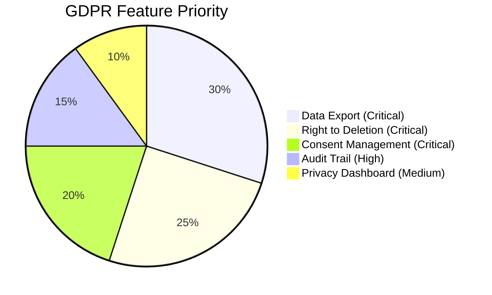
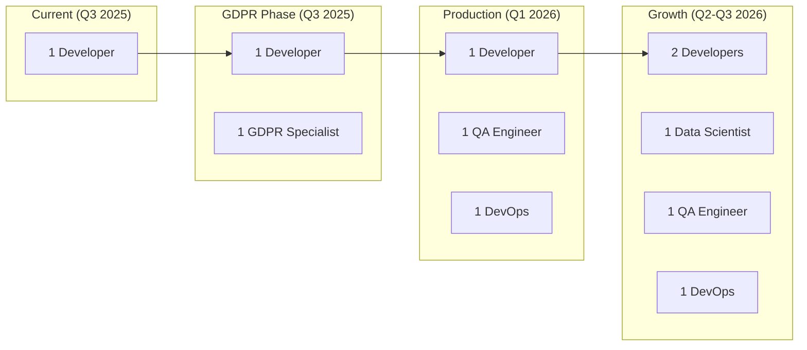
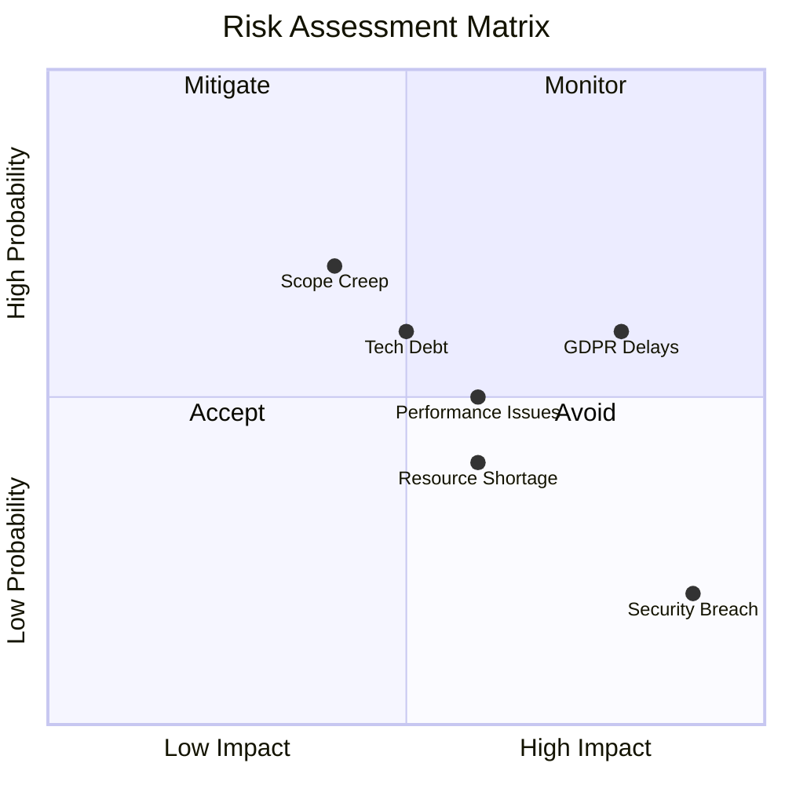
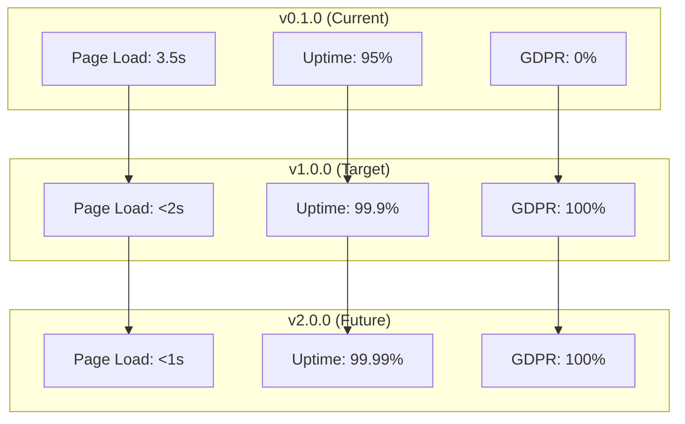

# CoachMeld Admin Dashboard - Visual Roadmap

## 2025-2026 Release Timeline

## Feature Development Flow

## GDPR Implementation Priority

## Resource Allocation Over Time

## Risk Heat Map

## Success Metrics Evolution

