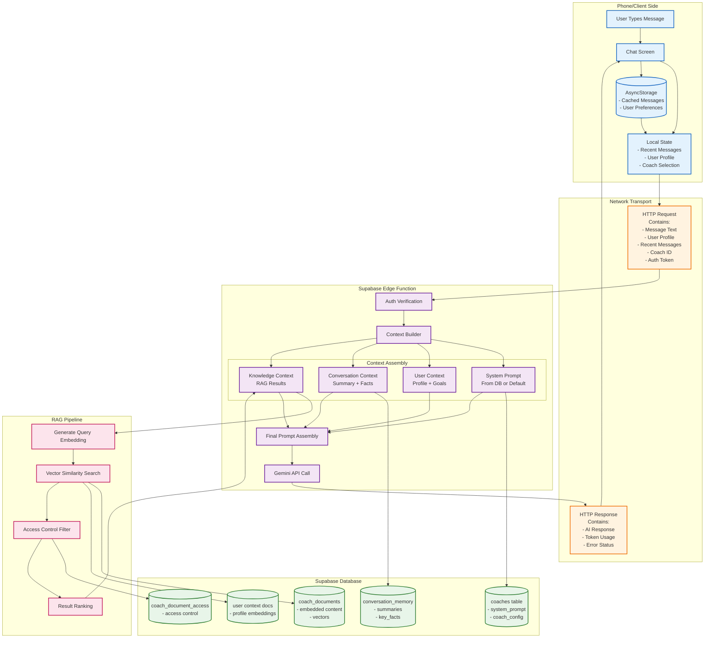
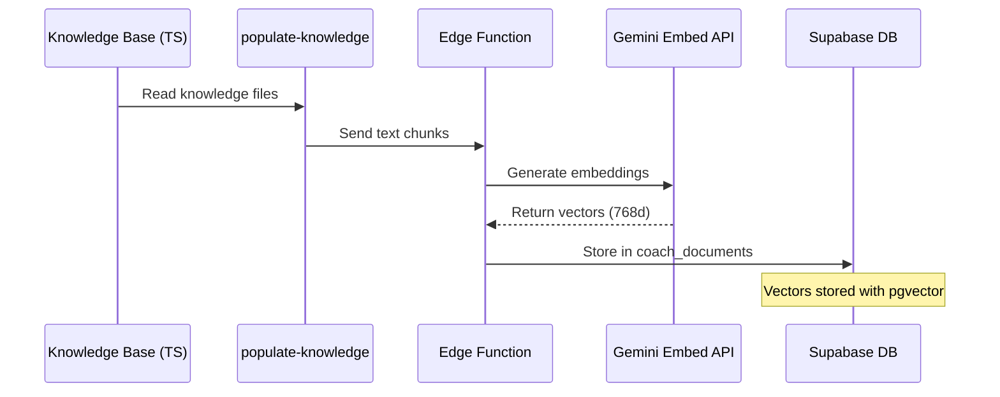

# Complete AI Context and Data Flow Documentation

## Overview

This document details the complete data flow when a user sends a message to an AI coach, including what data goes into the AI context, where it comes from, and what travels between the phone and server.

## Complete Data Flow Diagram



## What Goes Into AI Context

### 1. System Prompt (Server-Side)
- **Source**: `coaches` table in database
- **Fallback**: Hardcoded default prompts in code
- **Content**: Coach personality, diet expertise, response style
- **Variables**: `{{dietName}}`, `{{dietType}}`, `{{specialties}}`

### 2. User Context (Client → Server)
- **Source**: User profile from client
- **Content**:
  ```
  User Profile:
  - Name: [name]
  - Age: [age] years old
  - Gender: [gender]
  - Height: [height] [units]
  - Weight: [weight] [units]
  - Activity Level: [level]
  - Health Goals: [goals]
  - Dietary Preferences: [preferences]
  - Health Conditions: [conditions]
  ```

### 3. Conversation Context (Mixed)
- **Source**: Database + Recent messages from client
- **Content**:
  ```
  Previous Conversation Summary:
  [AI-generated summary after 20 messages]
  
  Key Facts About User:
  - Age: [extracted age]
  - Weight: [extracted weight]
  - Goals: [extracted goals]
  
  Recent Messages:
  [Last 10-20 messages between user and coach]
  ```

### 4. Knowledge Context (Server-Side RAG)
- **Source**: Vector search in `coach_documents` table
- **Process**:
  1. User message → Query embedding (768 dimensions)
  2. Vector similarity search in database
  3. Filter by access tier (free/premium/pro)
  4. Include user context documents
  5. Return top 3-5 most relevant chunks
- **Content**:
  ```
  Relevant Knowledge:
  [Document 1 - Similarity: 95%]
  [Content from knowledge base]
  
  [Document 2 - Similarity: 89%]
  [Content from FAQ or research]
  ```

## Data Flow Between Phone and Server

### Phone → Server (Request)
```json
{
  "prompt": "User's message text",
  "systemPrompt": null,  // Built server-side
  "userContext": "Formatted user profile string",
  "conversationContext": null,  // Built server-side
  "knowledgeContext": null,  // Built server-side
  "temperature": 0.7,
  "maxOutputTokens": 2048,
  "topK": 40,
  "topP": 0.95,
  "userId": "user-uuid",
  "coachId": "carnivore"
}
```

### Server Processing
1. **Authentication**: Verify user token
2. **System Prompt**: Fetch from DB or use default
3. **Conversation Memory**: Load summaries and facts
4. **RAG Search**: 
   - Generate embedding for user message
   - Search coach_documents with vector similarity
   - Filter by user's subscription tier
   - Include user context documents
5. **Prompt Assembly**: Combine all contexts
6. **Gemini API Call**: Send to AI model

### Server → Phone (Response)
```json
{
  "response": "AI-generated response text",
  "usage": {
    "promptTokens": 1234,
    "completionTokens": 567,
    "totalTokens": 1801
  }
}
```

## RAG Document and Embedding Flow

### Document Types in Database

1. **Knowledge Base Documents**
   - Source: TypeScript files → `populate-knowledge` script
   - Stored in: `coach_documents` table
   - Access via: `coach_document_access` junction table
   - Content: Diet knowledge, FAQs, guidelines

2. **User Context Documents**
   - Source: User profile and conversation history
   - Stored in: `coach_documents` table with special source_type
   - Updated: When profile changes or conversations progress
   - Content: User-specific information as embeddings

3. **External Documents** (future)
   - Source: PDFs, research papers, URLs
   - Stored in: `coach_documents` table
   - Tracked in: `document_sources` table
   - Content: Research, studies, expert content

### Embedding Generation Flow



## Performance Optimizations

### Client-Side Caching
- Recent messages in AsyncStorage
- User profile cached locally
- Coach selection persisted

### Server-Side Caching
- Query results cached for 24 hours
- System prompts cached in memory
- Conversation summaries updated incrementally

### RAG Optimizations
- Vector indexes for fast similarity search
- Access control integrated into queries
- Batch embedding generation
- Result ranking and filtering

## Security Considerations

1. **Authentication**: Every request verified
2. **Access Control**: RLS policies on all tables
3. **Data Isolation**: User data separated by user_id
4. **Subscription Gating**: Premium content protected
5. **Input Sanitization**: User messages cleaned
6. **Rate Limiting**: Prevent API abuse

## Summary

The complete flow involves:
1. **Client sends**: Message + minimal context
2. **Server enriches**: With system prompt, RAG results, conversation memory
3. **AI processes**: Full context (can be 2000+ tokens)
4. **Client receives**: Just the response text + usage stats

This architecture keeps sensitive data (prompts, knowledge) server-side while maintaining responsive UI through client-side caching of non-sensitive data.