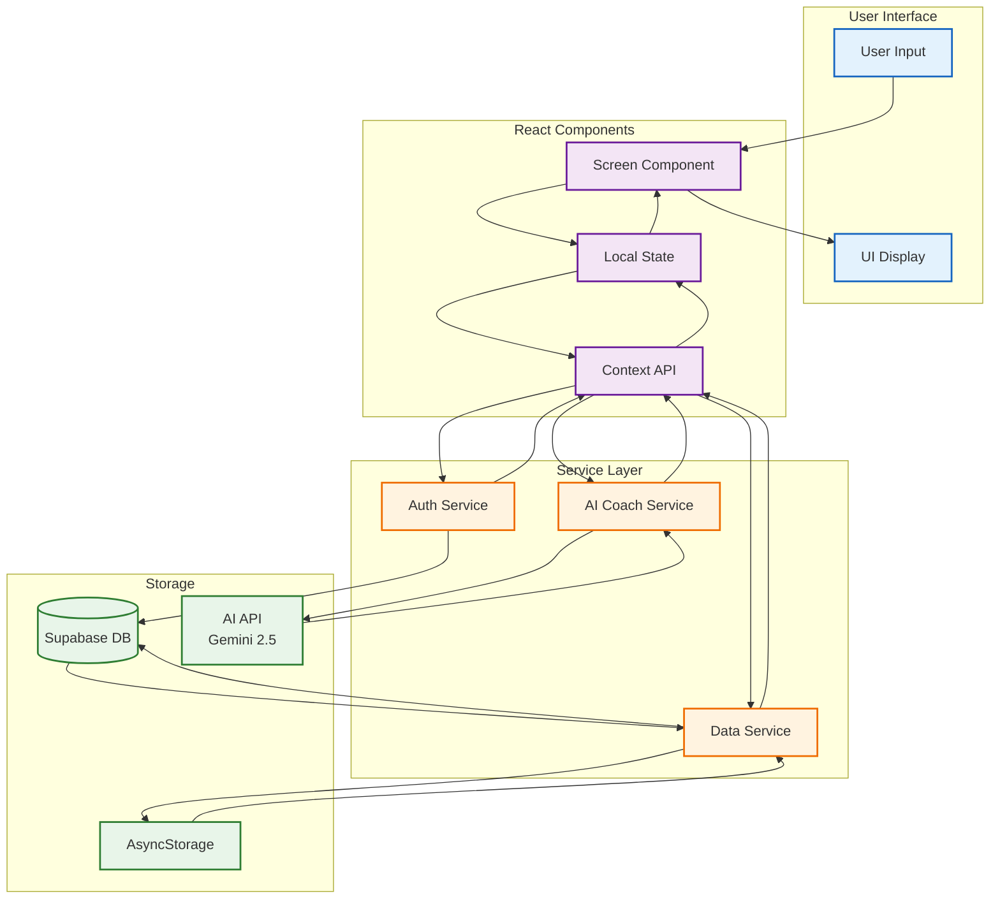
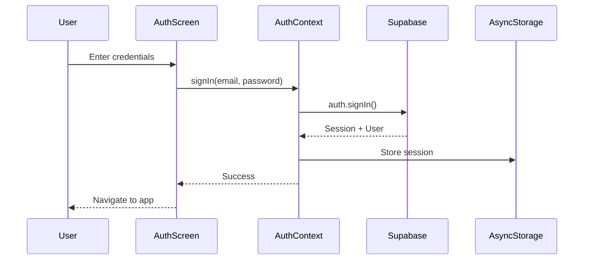
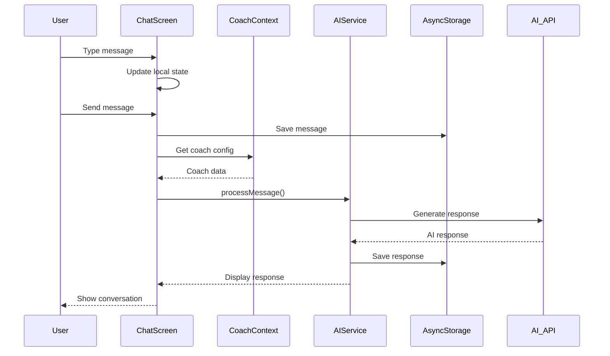
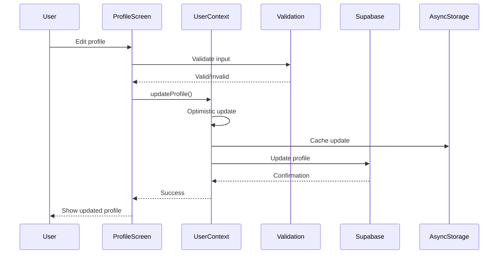
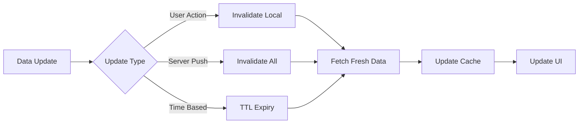

# CoachMeld Data Flow Documentation

## Data Flow Overview

This document describes how data flows through the CoachMeld application, from user input to backend services and back to the UI.

## Main Data Flow Diagram



## Detailed Data Flows

### 1. Authentication Flow



### 2. Chat Message Flow



### 3. Profile Update Flow



## Data Models

### User Profile
```typescript
interface UserProfile {
  id: string;                    // UUID from Supabase Auth
  email: string;                 // User email
  full_name: string;            // Display name
  age: number;                  // User age
  gender: 'male' | 'female' | 'other';
  height: number;               // In inches or cm
  weight: number;               // In lbs or kg
  goals: string[];              // Health goals
  dietary_restrictions: string[];
  units: 'imperial' | 'metric';
  created_at: string;           // ISO timestamp
  updated_at: string;           // ISO timestamp
}
```

### Chat Message
```typescript
interface Message {
  id: string;                   // UUID
  text: string;                 // Message content
  sender: 'user' | 'ai';       // Message source
  timestamp: string;            // ISO timestamp
  coachId?: string;            // Which coach responded
  metadata?: {
    processingTime?: number;    // Response time in ms
    model?: string;            // AI model used
    error?: boolean;           // If message failed
  };
}
```

### Coach Configuration
```typescript
interface Coach {
  id: string;                  // UUID
  name: string;                // Display name
  avatar: string;              // Image URL
  specialty: string;           // Coach focus area
  tier: 'free' | 'premium';    // Access level
  systemPrompt: string;        // AI instruction
  responseStyle: {
    tone: string;              // Friendly, professional, etc
    expertise: string[];       // Knowledge areas
    personality: string;       // Coach personality
  };
}
```

## API Integration Points

### Supabase APIs

#### Authentication
```typescript
// Sign Up
supabase.auth.signUp({ email, password })

// Sign In
supabase.auth.signIn({ email, password })

// Sign Out
supabase.auth.signOut()

// Session Management
supabase.auth.onAuthStateChange((event, session) => {})
```

#### Database Operations
```typescript
// Fetch Profile
supabase
  .from('profiles')
  .select('*')
  .eq('id', userId)
  .single()

// Update Profile
supabase
  .from('profiles')
  .update(updates)
  .eq('id', userId)

// Real-time Subscriptions
supabase
  .from('messages')
  .on('INSERT', handleNewMessage)
  .subscribe()
```

### AI Service Integration

```typescript
// Current Mock Implementation
async function generateAIResponse(message: string, coach: Coach): Promise<string> {
  // Simulate API delay
  await new Promise(resolve => setTimeout(resolve, 1000));
  
  // Generate contextual response
  return generateResponse(message, coach);
}

// Future Gemini Integration
async function generateAIResponse(message: string, coach: Coach): Promise<string> {
  const response = await geminiAPI.generateContent({
    model: 'gemini-2.5-pro',
    systemInstruction: coach.systemPrompt,
    contents: [{ role: 'user', parts: [{ text: message }] }],
    generationConfig: {
      temperature: 0.7,
      maxOutputTokens: 1000,
    }
  });
  
  return response.text();
}
```

## Caching Strategy

### Local Cache Layers

1. **Memory Cache** (React State)
   - Active session data
   - Current conversation
   - UI state

2. **AsyncStorage** (Persistent)
   - User preferences
   - Offline messages
   - Coach selection
   - Theme preference

3. **Supabase Cache** (Server)
   - User profiles
   - Historical data
   - Subscription status

### Cache Invalidation


## Error Handling

### Error Flow
```typescript
try {
  // Attempt operation
  const result = await apiCall();
  
  // Update local state
  setState(result);
  
  // Cache result
  await AsyncStorage.setItem(key, result);
} catch (error) {
  // Log error
  console.error('Operation failed:', error);
  
  // Update UI with error state
  setError(error.message);
  
  // Attempt recovery
  const cached = await AsyncStorage.getItem(key);
  if (cached) {
    setState(cached);
    showToast('Using cached data');
  }
}
```

## Performance Optimizations

### Data Fetching Strategies

1. **Prefetching**
   - Load coach data on app start
   - Prefetch common responses
   - Cache meal suggestions

2. **Lazy Loading**
   - Load messages on scroll
   - Defer heavy computations
   - Progressive image loading

3. **Batching**
   - Batch API requests
   - Combine state updates
   - Debounce user input

### Real-time Sync
```typescript
// Efficient real-time sync
const subscription = supabase
  .from('messages')
  .on('INSERT', (payload) => {
    // Only update if relevant
    if (payload.new.chat_id === currentChatId) {
      setMessages(prev => [...prev, payload.new]);
    }
  })
  .subscribe();
```

## Security Considerations

### Data Protection

1. **In Transit**
   - HTTPS for all API calls
   - Certificate pinning (future)
   - Request signing

2. **At Rest**
   - Encrypted AsyncStorage
   - Secure key management
   - No sensitive data in logs

3. **Access Control**
   - Row Level Security (RLS)
   - JWT token validation
   - Session expiry handling