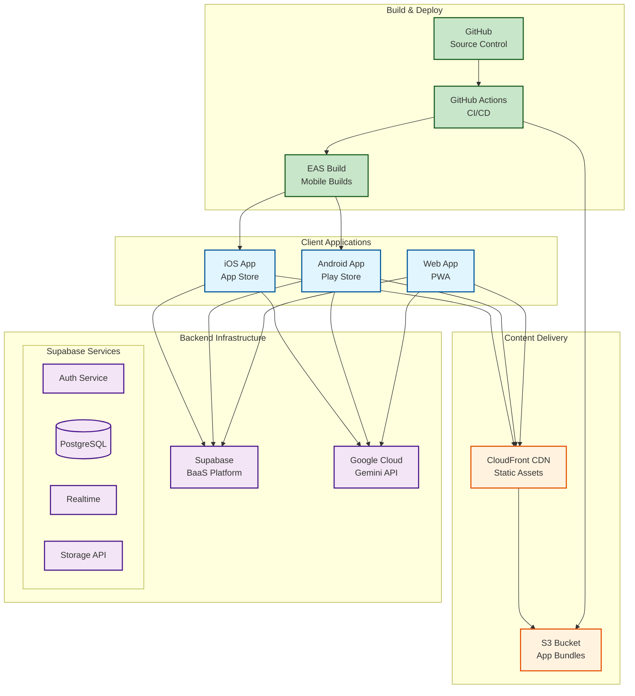
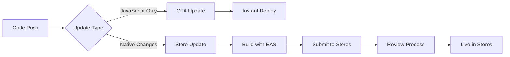
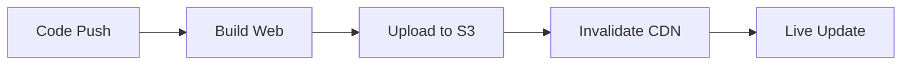
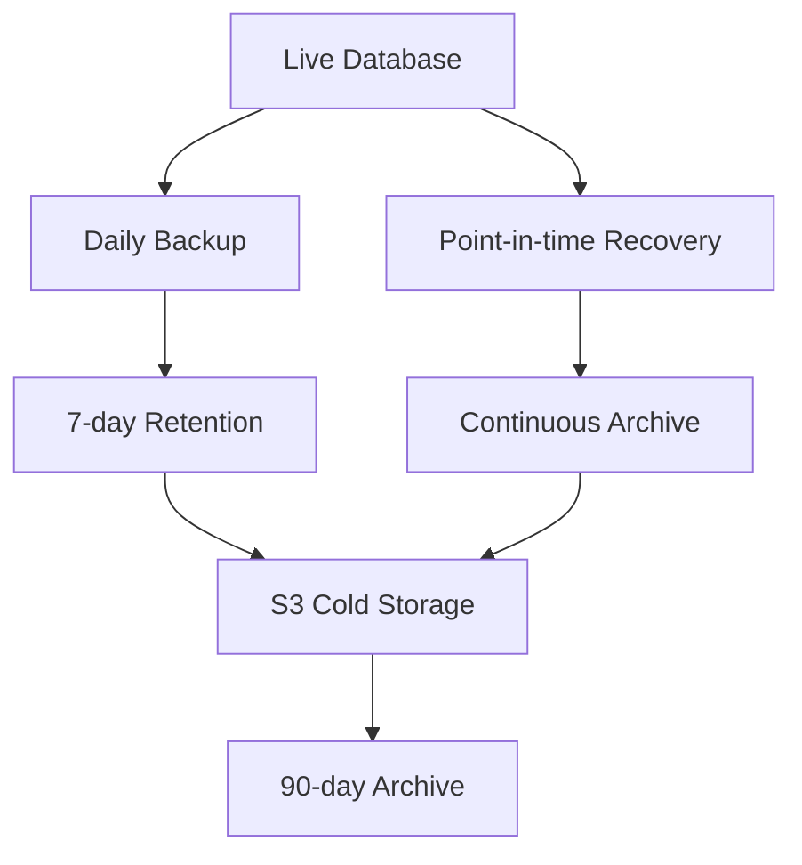

# CoachMeld Deployment Architecture

## Deployment Overview

This document outlines the deployment architecture, infrastructure requirements, and deployment strategies for the CoachMeld application.

## Infrastructure Architecture



## Environment Configuration

### Development Environment
```bash
# .env.development
EXPO_PUBLIC_SUPABASE_URL=https://dev-project.supabase.co
EXPO_PUBLIC_SUPABASE_ANON_KEY=dev-anon-key
EXPO_PUBLIC_API_URL=http://localhost:3000
EXPO_PUBLIC_ENVIRONMENT=development
```

### Staging Environment
```bash
# .env.staging
EXPO_PUBLIC_SUPABASE_URL=https://staging-project.supabase.co
EXPO_PUBLIC_SUPABASE_ANON_KEY=staging-anon-key
EXPO_PUBLIC_API_URL=https://api-staging.coachmeld.com
EXPO_PUBLIC_ENVIRONMENT=staging
```

### Production Environment
```bash
# .env.production
EXPO_PUBLIC_SUPABASE_URL=https://prod-project.supabase.co
EXPO_PUBLIC_SUPABASE_ANON_KEY=prod-anon-key
EXPO_PUBLIC_API_URL=https://api.coachmeld.com
EXPO_PUBLIC_ENVIRONMENT=production
```

## Build Configuration

### EAS Build Profiles

```json
{
  "build": {
    "development": {
      "developmentClient": true,
      "distribution": "internal",
      "env": {
        "EXPO_PUBLIC_ENVIRONMENT": "development"
      }
    },
    "staging": {
      "distribution": "internal",
      "env": {
        "EXPO_PUBLIC_ENVIRONMENT": "staging"
      }
    },
    "production": {
      "distribution": "store",
      "env": {
        "EXPO_PUBLIC_ENVIRONMENT": "production"
      }
    }
  }
}
```

## CI/CD Pipeline

### GitHub Actions Workflow

```yaml
name: Build and Deploy

on:
  push:
    branches: [main, develop]
  pull_request:
    branches: [main]

jobs:
  test:
    runs-on: ubuntu-latest
    steps:
      - uses: actions/checkout@v3
      - uses: actions/setup-node@v3
      - run: npm ci
      - run: npm test
      - run: npm run lint
      - run: npm run type-check

  build-staging:
    needs: test
    if: github.ref == 'refs/heads/develop'
    runs-on: ubuntu-latest
    steps:
      - uses: actions/checkout@v3
      - uses: expo/expo-github-action@v7
      - run: eas build --platform all --profile staging

  build-production:
    needs: test
    if: github.ref == 'refs/heads/main'
    runs-on: ubuntu-latest
    steps:
      - uses: actions/checkout@v3
      - uses: expo/expo-github-action@v7
      - run: eas build --platform all --profile production
      - run: eas submit --platform all
```

## Deployment Strategies

### Mobile App Deployment



### Web Deployment



## Monitoring & Analytics

### Application Monitoring

```typescript
// Sentry Integration
import * as Sentry from 'sentry-expo';

Sentry.init({
  dsn: process.env.EXPO_PUBLIC_SENTRY_DSN,
  enableInExpoDevelopment: false,
  debug: __DEV__,
  environment: process.env.EXPO_PUBLIC_ENVIRONMENT,
});

// Error Boundary
export function ErrorBoundary({ children }) {
  return (
    <Sentry.Native.ErrorBoundary
      fallback={ErrorFallback}
      showDialog
    >
      {children}
    </Sentry.Native.ErrorBoundary>
  );
}
```

### Performance Monitoring

```typescript
// Performance tracking
import analytics from '@segment/analytics-react-native';

analytics.setup(process.env.EXPO_PUBLIC_SEGMENT_KEY, {
  trackAppLifecycleEvents: true,
  trackAttributionData: true,
});

// Track key metrics
analytics.track('App Launched', {
  environment: process.env.EXPO_PUBLIC_ENVIRONMENT,
  version: Constants.manifest.version,
});
```

## Scaling Architecture

### Database Scaling

```sql
-- Supabase Performance Optimizations
-- Indexes for common queries
CREATE INDEX idx_messages_user_id ON messages(user_id);
CREATE INDEX idx_messages_created_at ON messages(created_at DESC);
CREATE INDEX idx_profiles_email ON profiles(email);

-- Materialized views for analytics
CREATE MATERIALIZED VIEW user_stats AS
SELECT 
  user_id,
  COUNT(*) as message_count,
  MAX(created_at) as last_active
FROM messages
GROUP BY user_id;
```

### API Rate Limiting

```typescript
// Rate limiting configuration
const rateLimiter = {
  ai_requests: {
    points: 100,      // Number of requests
    duration: 3600,   // Per hour
    blockDuration: 600 // Block for 10 minutes
  },
  api_requests: {
    points: 1000,
    duration: 3600,
    blockDuration: 300
  }
};
```

## Security Measures

### Security Checklist

- [ ] Environment variables properly configured
- [ ] API keys never committed to repository
- [ ] Certificate pinning implemented
- [ ] Proper authentication flow
- [ ] Row Level Security enabled
- [ ] Input validation on all forms
- [ ] XSS protection for web version
- [ ] Regular security audits
- [ ] Dependency vulnerability scanning

### Backup Strategy



## Cost Optimization

### Resource Usage Monitoring

| Service | Metric | Alert Threshold | Monthly Budget |
|---------|---------|----------------|----------------|
| Supabase | Database Size | 80% of limit | $25 |
| Supabase | API Requests | 90% of quota | Included |
| EAS Build | Build Minutes | 400 minutes | $0 (free tier) |
| Gemini API | Tokens Used | 80% of quota | $50 |
| CDN | Bandwidth | 100GB | $10 |

### Optimization Strategies

1. **Caching**
   - Implement aggressive caching
   - Use CDN for static assets
   - Cache AI responses when appropriate

2. **Code Splitting**
   - Lazy load screens
   - Dynamic imports
   - Minimize bundle size

3. **Database Optimization**
   - Efficient queries
   - Proper indexing
   - Archive old data

## Disaster Recovery

### Recovery Plan

1. **Data Loss**
   - Restore from latest backup
   - Point-in-time recovery if needed
   - Notify affected users

2. **Service Outage**
   - Failover to cached data
   - Show service status
   - Queue operations for retry

3. **Security Breach**
   - Revoke all tokens
   - Force password reset
   - Audit access logs
   - Notify users per regulations

### RTO/RPO Targets

- **Recovery Time Objective (RTO)**: 4 hours
- **Recovery Point Objective (RPO)**: 1 hour
- **Uptime Target**: 99.9% (8.76 hours downtime/year)