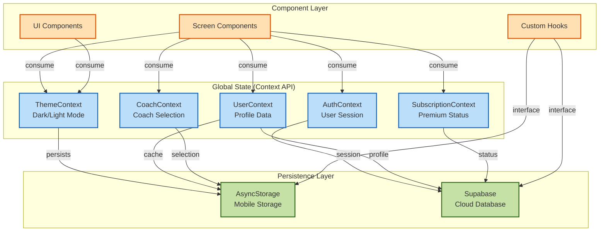
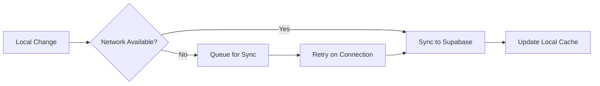

# CoachMeld State Management Documentation

## State Management Overview

CoachMeld uses React Context API for global state management, combined with local component state and custom hooks for a scalable architecture.

## State Architecture Diagram



## Context Providers in Detail

### 1. ThemeContext

**Purpose**: Manages application theme (dark/light mode)

```typescript
interface ThemeContextType {
  theme: Theme;
  toggleTheme: () => void;
}

interface Theme {
  name: 'light' | 'dark';
  background: string;
  surface: string;
  primary: string;
  text: string;
  textSecondary: string;
  border: string;
  // ... other color properties
}
```

**State Flow**:
```
User Toggle → toggleTheme() → Update State → Save to AsyncStorage → Re-render UI
```

### 2. AuthContext

**Purpose**: Manages user authentication state and session

```typescript
interface AuthContextType {
  user: User | null;
  loading: boolean;
  signUp: (email: string, password: string) => Promise<void>;
  signIn: (email: string, password: string) => Promise<void>;
  signOut: () => Promise<void>;
  session: Session | null;
}
```

**State Flow**:
```
Login Form → signIn() → Supabase Auth → Update Session → Store Token → Navigate
```

### 3. UserContext

**Purpose**: Manages user profile and preferences

```typescript
interface UserContextType {
  profile: UserProfile | null;
  loading: boolean;
  updateProfile: (updates: Partial<UserProfile>) => Promise<void>;
  refreshProfile: () => Promise<void>;
}

interface UserProfile {
  id: string;
  email: string;
  full_name: string;
  age: number;
  gender: string;
  height: number;
  weight: number;
  goals: string[];
  dietary_restrictions: string[];
  units: 'imperial' | 'metric';
  created_at: string;
  updated_at: string;
}
```

**State Management**:
- Syncs with Supabase on auth state change
- Caches in AsyncStorage for offline access
- Updates propagate to all consuming components

### 4. CoachContext

**Purpose**: Manages coach selection and coach-specific data

```typescript
interface CoachContextType {
  selectedCoach: Coach | null;
  coaches: Coach[];
  selectCoach: (coachId: string) => void;
  coachHistory: CoachInteraction[];
}

interface Coach {
  id: string;
  name: string;
  specialty: string;
  avatar: string;
  systemPrompt: string;
  tier: 'free' | 'premium';
}
```

### 5. SubscriptionContext

**Purpose**: Manages subscription status and feature access

```typescript
interface SubscriptionContextType {
  subscription: Subscription | null;
  isSubscribed: boolean;
  canAccessFeature: (feature: string) => boolean;
  subscribeToPlan: (planId: string) => Promise<void>;
}
```

## State Update Patterns

### 1. Optimistic Updates
```typescript
// Example: Profile update with optimistic UI
const updateProfile = async (updates) => {
  // Optimistically update local state
  setProfile(prev => ({ ...prev, ...updates }));
  
  try {
    // Attempt server update
    await supabase.from('profiles').update(updates);
  } catch (error) {
    // Revert on failure
    setProfile(previousProfile);
    throw error;
  }
};
```

### 2. Debounced Updates
```typescript
// Example: Chat input with debounced save
const debouncedSave = useMemo(
  () => debounce((message) => {
    AsyncStorage.setItem('draft_message', message);
  }, 500),
  []
);
```

### 3. Subscription Pattern
```typescript
// Example: Real-time updates
useEffect(() => {
  const subscription = supabase
    .from('messages')
    .on('INSERT', handleNewMessage)
    .subscribe();
    
  return () => subscription.unsubscribe();
}, []);
```

## Custom Hooks

### useSupabaseChat
```typescript
function useSupabaseChat(userId: string) {
  const [messages, setMessages] = useState<Message[]>([]);
  const [loading, setLoading] = useState(true);
  
  // Fetch messages
  // Subscribe to updates
  // Return interface
  
  return { messages, loading, sendMessage, deleteMessage };
}
```

### useSupabaseProfile
```typescript
function useSupabaseProfile(userId: string) {
  const [profile, setProfile] = useState<UserProfile | null>(null);
  const [loading, setLoading] = useState(true);
  
  // Fetch profile
  // Handle updates
  // Cache management
  
  return { profile, loading, updateProfile };
}
```

## State Persistence Strategy

### AsyncStorage Keys
```
- @theme_preference     // Theme selection
- @user_profile        // Cached profile
- @selected_coach      // Current coach
- @chat_messages       // Offline messages
- @draft_message       // Unsent message
- @onboarding_complete // Onboarding status
```

### Sync Strategy


## Performance Considerations

### 1. Selective Re-renders
- Use React.memo for expensive components
- Split contexts to minimize update scope
- Implement selector patterns for partial state

### 2. Lazy State Initialization
```typescript
const [state, setState] = useState(() => {
  // Expensive initialization only runs once
  return computeInitialState();
});
```

### 3. State Normalization
```typescript
// Normalized state shape
{
  entities: {
    messages: { [id]: Message },
    coaches: { [id]: Coach }
  },
  ids: {
    messages: string[],
    coaches: string[]
  }
}
```

## Testing State Management

### Unit Tests
```typescript
describe('UserContext', () => {
  it('updates profile optimistically', async () => {
    const { result } = renderHook(() => useUserContext());
    
    await act(async () => {
      await result.current.updateProfile({ name: 'New Name' });
    });
    
    expect(result.current.profile.name).toBe('New Name');
  });
});
```

### Integration Tests
- Test context provider composition
- Verify state persistence
- Test error handling
- Validate sync mechanisms

## State Debugging

### Development Tools
1. React DevTools for context inspection
2. Redux DevTools (with context bridge)
3. Custom logging middleware
4. State snapshots for debugging

### Common Issues
1. **Stale Closures**: Use ref or callback patterns
2. **Race Conditions**: Implement proper async handling
3. **Memory Leaks**: Clean up subscriptions
4. **Performance**: Monitor re-render frequency