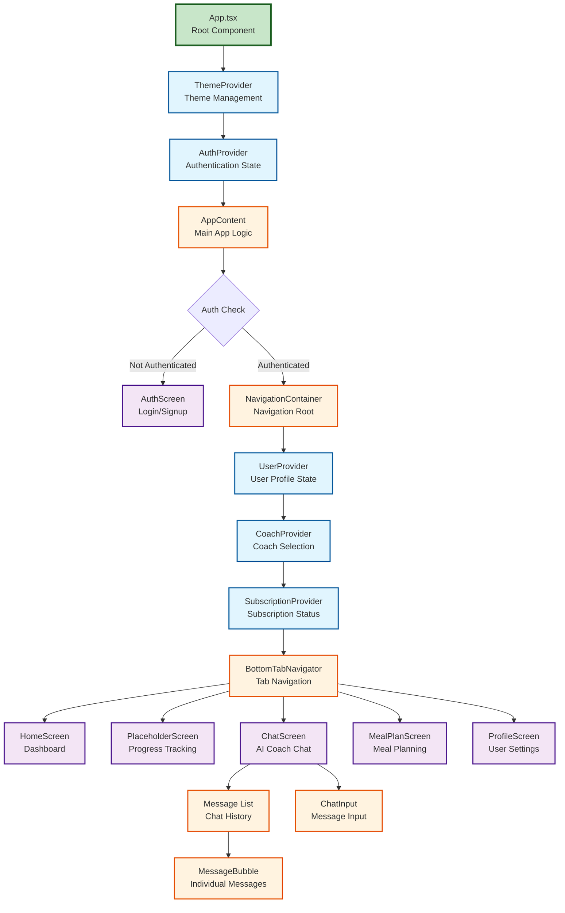

# CoachMeld Component Diagram

## Component Architecture Overview



## Component Relationships

### 1. Provider Hierarchy
```
ThemeProvider (Global Theme)
└── AuthProvider (Authentication)
    └── UserProvider (User Data)
        └── CoachProvider (Coach Selection)
            └── SubscriptionProvider (Premium Features)
```

### 2. Screen Components

#### HomeScreen
```typescript
interface HomeScreenProps {
  navigation: NavigationProp
}

Dependencies:
- UserContext (user data)
- ThemeContext (styling)
- Navigation (screen transitions)
```

#### ChatScreen
```typescript
interface ChatScreenProps {
  navigation: NavigationProp
}

Components:
- MessageBubble (display messages)
- ChatInput (user input)
- ScrollView (message list)

Dependencies:
- CoachContext (selected coach)
- aiCoachService (message processing)
- AsyncStorage (message persistence)
```

#### ProfileScreen
```typescript
interface ProfileScreenProps {
  navigation: NavigationProp
}

Features:
- User info form
- Unit selection
- Theme toggle
- Sign out

Dependencies:
- UserContext (profile data)
- AuthContext (sign out)
- ThemeContext (theme toggle)
```

### 3. Reusable Components

#### MessageBubble
```typescript
interface MessageBubbleProps {
  message: Message
  isUser: boolean
}

Features:
- Conditional styling (user/AI)
- Timestamp display
- Message text rendering
```

#### ChatInput
```typescript
interface ChatInputProps {
  onSendMessage: (text: string) => void
  disabled?: boolean
}

Features:
- Text input field
- Send button
- Loading state
- Keyboard handling
```

#### BottomTabNavigator
```typescript
Features:
- 5 tab navigation
- Icon integration
- Active tab highlighting
- Badge support (future)
```

## Component Communication

### Data Flow Patterns

1. **Props Drilling Prevention**
   - Context API for global state
   - Hooks for accessing context
   - Component composition

2. **Event Handling**
   ```
   User Action → Component Event → Context Update → UI Re-render
   ```

3. **Async Operations**
   ```
   Component → Service Call → Loading State → Success/Error → Update UI
   ```

### State Management by Component

| Component | Local State | Context Usage | External APIs |
|-----------|-------------|---------------|---------------|
| App | - | ThemeContext | - |
| AuthScreen | form data | AuthContext | Supabase Auth |
| ChatScreen | messages, input | CoachContext, UserContext | AI Service |
| ProfileScreen | form data | UserContext, AuthContext | Supabase DB |
| HomeScreen | - | UserContext | - |
| MealPlanScreen | selected meals | UserContext | - |

## Component Lifecycle

### Initialization Flow
```
1. App.tsx loads
2. Providers initialize
3. Auth check performed
4. Navigation setup
5. Initial screen rendered
6. Data fetching begins
7. UI updates with data
```

### Update Flow
```
1. User interaction
2. State update triggered
3. Context notifies subscribers
4. Components re-render
5. Side effects execute
6. UI reflects new state
```

## Performance Optimization

### Component Optimization Strategies

1. **Memoization**
   - React.memo for pure components
   - useMemo for expensive computations
   - useCallback for stable callbacks

2. **Lazy Loading**
   - Screen-level code splitting
   - Dynamic imports for heavy features
   - Suspense boundaries

3. **Virtual Lists**
   - FlatList for message history
   - Pagination for large datasets
   - Incremental loading

## Component Testing Strategy

### Unit Tests
- Individual component rendering
- Props validation
- Event handler testing
- State updates

### Integration Tests
- Navigation flow
- Context integration
- API mocking
- User workflows

### E2E Tests
- Full user journeys
- Cross-platform testing
- Performance metrics
- Error scenarios