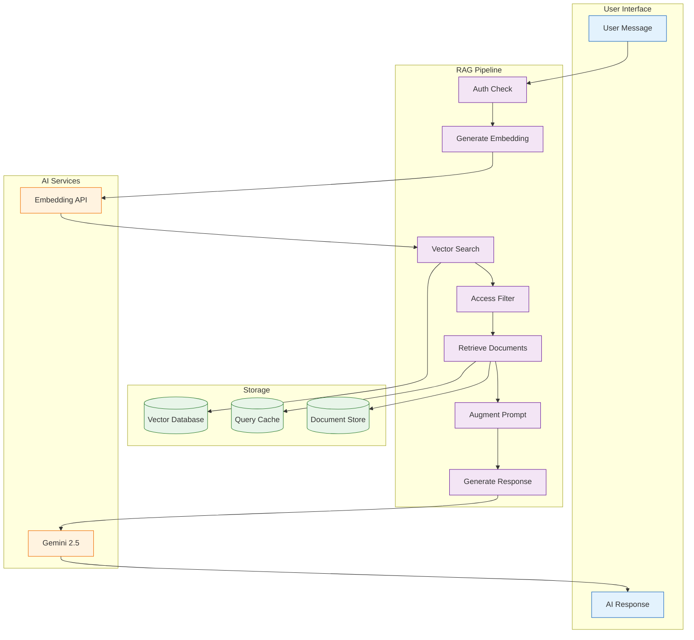

# CoachMeld RAG (Retrieval-Augmented Generation) Implementation Guide

## Table of Contents
1. [Overview](#overview)
2. [Architecture](#architecture)
3. [Vector Database Setup](#vector-database-setup)
4. [Document Ingestion Pipeline](#document-ingestion-pipeline)
5. [Query and Retrieval System](#query-and-retrieval-system)
6. [Integration with Coach System](#integration-with-coach-system)
7. [Performance Optimization](#performance-optimization)
8. [Security Considerations](#security-considerations)

## Overview

The CoachMeld RAG system enhances AI coaches with domain-specific knowledge by retrieving relevant information from a vector database before generating responses. This allows coaches to provide accurate, personalized advice based on curated knowledge bases.

### Key Features
- **Multi-coach support** with isolated knowledge bases
- **Subscription-based access control**
- **Custom research data integration**
- **Real-time knowledge updates**
- **Efficient vector similarity search**
- **Caching for performance**

## Architecture

### High-Level RAG Architecture



### Component Architecture

```typescript
// Core RAG Components
interface RAGSystem {
  documentProcessor: DocumentProcessor;
  embeddingService: EmbeddingService;
  vectorStore: VectorStore;
  retrievalService: RetrievalService;
  promptBuilder: PromptBuilder;
  responseGenerator: ResponseGenerator;
}

// Document Processing
interface DocumentProcessor {
  ingest(document: Document): Promise<ProcessedChunks[]>;
  chunk(text: string, strategy: ChunkingStrategy): Chunk[];
  extractMetadata(document: Document): Metadata;
}

// Vector Operations
interface VectorStore {
  upsert(embeddings: Embedding[]): Promise<void>;
  search(query: QueryEmbedding, filters: SearchFilters): Promise<SearchResult[]>;
  delete(ids: string[]): Promise<void>;
}
```

## Vector Database Setup

### Using Supabase pgvector

```sql
-- Enable pgvector extension
CREATE EXTENSION IF NOT EXISTS vector;

-- Coach knowledge base documents
CREATE TABLE coach_documents (
    id UUID DEFAULT gen_random_uuid() PRIMARY KEY,
    coach_id VARCHAR(50) NOT NULL,
    title TEXT NOT NULL,
    content TEXT NOT NULL,
    chunk_index INTEGER NOT NULL,
    metadata JSONB DEFAULT '{}',
    embedding vector(1536), -- OpenAI embeddings dimension
    created_at TIMESTAMPTZ DEFAULT NOW(),
    updated_at TIMESTAMPTZ DEFAULT NOW(),
    version INTEGER DEFAULT 1,
    is_active BOOLEAN DEFAULT true,
    
    -- Indexes for performance
    INDEX idx_coach_documents_coach_id (coach_id),
    INDEX idx_coach_documents_embedding (embedding vector_l2_ops)
);

-- Document sources tracking
CREATE TABLE document_sources (
    id UUID DEFAULT gen_random_uuid() PRIMARY KEY,
    coach_id VARCHAR(50) NOT NULL,
    title TEXT NOT NULL,
    source_type VARCHAR(20) CHECK (source_type IN ('pdf', 'txt', 'md', 'docx', 'url')),
    source_url TEXT,
    file_hash VARCHAR(64),
    last_processed TIMESTAMPTZ,
    process_status VARCHAR(20) DEFAULT 'pending',
    metadata JSONB DEFAULT '{}',
    created_at TIMESTAMPTZ DEFAULT NOW()
);

-- Query cache for performance
CREATE TABLE rag_query_cache (
    id UUID DEFAULT gen_random_uuid() PRIMARY KEY,
    query_hash VARCHAR(64) UNIQUE NOT NULL,
    coach_id VARCHAR(50) NOT NULL,
    query_embedding vector(1536),
    retrieved_documents JSONB NOT NULL,
    created_at TIMESTAMPTZ DEFAULT NOW(),
    expires_at TIMESTAMPTZ DEFAULT NOW() + INTERVAL '24 hours'
);

-- Access control
CREATE TABLE coach_access_tiers (
    coach_id VARCHAR(50) NOT NULL,
    document_id UUID REFERENCES coach_documents(id),
    required_tier VARCHAR(20) CHECK (required_tier IN ('free', 'premium', 'pro')),
    PRIMARY KEY (coach_id, document_id)
);

-- Create indexes for performance
CREATE INDEX idx_documents_active ON coach_documents(is_active) WHERE is_active = true;
CREATE INDEX idx_cache_expires ON rag_query_cache(expires_at);
CREATE INDEX idx_sources_status ON document_sources(process_status);

-- RLS Policies
ALTER TABLE coach_documents ENABLE ROW LEVEL SECURITY;
ALTER TABLE document_sources ENABLE ROW LEVEL SECURITY;
ALTER TABLE rag_query_cache ENABLE ROW LEVEL SECURITY;

-- Policy for document access based on user subscriptions
CREATE POLICY "Users can access documents based on subscriptions" ON coach_documents
    FOR SELECT USING (
        coach_id IN (
            SELECT coach_id FROM user_coach_subscriptions
            WHERE user_id = auth.uid()
            AND status = 'active'
        )
    );
```

### Alternative: Using Pinecone

```typescript
// Pinecone configuration
import { PineconeClient } from '@pinecone-database/pinecone';

const pinecone = new PineconeClient();
await pinecone.init({
    environment: process.env.PINECONE_ENVIRONMENT,
    apiKey: process.env.PINECONE_API_KEY,
});

const index = pinecone.Index('coachmeld-knowledge');

// Upsert embeddings with metadata
await index.upsert({
    vectors: [
        {
            id: 'doc-1',
            values: embedding,
            metadata: {
                coach_id: 'carnivore',
                tier: 'premium',
                source: 'research_paper_1.pdf',
                chunk_index: 0,
                content: originalText
            }
        }
    ]
});
```

## Document Ingestion Pipeline

### Document Processing Flow

```typescript
// Document ingestion service
export class DocumentIngestionService {
    private chunkSize = 1000; // tokens
    private chunkOverlap = 200; // tokens
    
    async ingestDocument(
        filePath: string,
        coachId: string,
        metadata: DocumentMetadata
    ): Promise<void> {
        // 1. Extract text from document
        const text = await this.extractText(filePath);
        
        // 2. Clean and preprocess text
        const cleanedText = this.preprocessText(text);
        
        // 3. Split into chunks with overlap
        const chunks = this.chunkText(cleanedText);
        
        // 4. Generate embeddings for each chunk
        const embeddings = await this.generateEmbeddings(chunks);
        
        // 5. Store in vector database
        await this.storeEmbeddings(embeddings, coachId, metadata);
        
        // 6. Update document source tracking
        await this.updateSourceTracking(filePath, coachId, 'completed');
    }
    
    private chunkText(text: string): Chunk[] {
        const chunks: Chunk[] = [];
        const sentences = text.split(/[.!?]+/);
        let currentChunk = '';
        let currentTokens = 0;
        
        for (const sentence of sentences) {
            const sentenceTokens = this.countTokens(sentence);
            
            if (currentTokens + sentenceTokens > this.chunkSize) {
                // Save current chunk
                chunks.push({
                    text: currentChunk,
                    tokens: currentTokens
                });
                
                // Start new chunk with overlap
                const overlap = this.getOverlapText(currentChunk);
                currentChunk = overlap + sentence;
                currentTokens = this.countTokens(currentChunk);
            } else {
                currentChunk += ' ' + sentence;
                currentTokens += sentenceTokens;
            }
        }
        
        // Don't forget the last chunk
        if (currentChunk) {
            chunks.push({
                text: currentChunk,
                tokens: currentTokens
            });
        }
        
        return chunks;
    }
    
    private async generateEmbeddings(chunks: Chunk[]): Promise<Embedding[]> {
        const embeddings: Embedding[] = [];
        
        // Batch process for efficiency
        const batchSize = 10;
        for (let i = 0; i < chunks.length; i += batchSize) {
            const batch = chunks.slice(i, i + batchSize);
            const batchEmbeddings = await this.embeddingAPI.createEmbeddings(
                batch.map(c => c.text)
            );
            embeddings.push(...batchEmbeddings);
        }
        
        return embeddings;
    }
}
```

### Supported Document Types

```typescript
// Document type handlers
export const documentHandlers = {
    pdf: async (filePath: string) => {
        const pdfParse = require('pdf-parse');
        const dataBuffer = fs.readFileSync(filePath);
        const data = await pdfParse(dataBuffer);
        return data.text;
    },
    
    txt: async (filePath: string) => {
        return fs.readFileSync(filePath, 'utf-8');
    },
    
    md: async (filePath: string) => {
        const content = fs.readFileSync(filePath, 'utf-8');
        // Remove markdown formatting for cleaner text
        return content.replace(/[#*_~`]/g, '');
    },
    
    docx: async (filePath: string) => {
        const mammoth = require('mammoth');
        const result = await mammoth.extractRawText({ path: filePath });
        return result.value;
    }
};
```

## Query and Retrieval System

### Retrieval Implementation

```typescript
// Supabase Edge Function: /supabase/functions/rag-retrieve/index.ts
import { serve } from 'https://deno.land/std@0.177.0/http/server.ts';
import { createClient } from 'https://esm.sh/@supabase/supabase-js@2';

interface RetrievalRequest {
    query: string;
    coachId: string;
    userId: string;
    topK?: number;
    filters?: SearchFilters;
}

serve(async (req) => {
    const { query, coachId, userId, topK = 5 } = await req.json();
    
    // 1. Check user access
    const userTier = await getUserSubscriptionTier(userId, coachId);
    
    // 2. Check cache first
    const cachedResult = await checkCache(query, coachId);
    if (cachedResult) {
        return new Response(JSON.stringify(cachedResult), {
            headers: { 'Content-Type': 'application/json' }
        });
    }
    
    // 3. Generate query embedding
    const queryEmbedding = await generateEmbedding(query);
    
    // 4. Perform vector search with access control
    const searchQuery = `
        WITH user_access AS (
            SELECT CASE 
                WHEN EXISTS (
                    SELECT 1 FROM user_coach_subscriptions 
                    WHERE user_id = $1 
                    AND coach_id = $2 
                    AND status = 'active'
                    AND tier = 'premium'
                ) THEN 'premium'
                ELSE 'free'
            END as user_tier
        )
        SELECT 
            d.id,
            d.title,
            d.content,
            d.metadata,
            1 - (d.embedding <=> $3) as similarity
        FROM coach_documents d
        LEFT JOIN coach_access_tiers cat ON d.id = cat.document_id
        CROSS JOIN user_access
        WHERE d.coach_id = $2
        AND d.is_active = true
        AND (
            cat.required_tier IS NULL 
            OR cat.required_tier = 'free'
            OR (user_access.user_tier = 'premium' AND cat.required_tier = 'premium')
        )
        ORDER BY d.embedding <=> $3
        LIMIT $4;
    `;
    
    const { data: documents, error } = await supabase
        .rpc('vector_search', {
            query_embedding: queryEmbedding,
            match_threshold: 0.7,
            match_count: topK,
            coach_id: coachId,
            user_id: userId
        });
    
    // 5. Post-process results
    const processedDocs = documents.map(doc => ({
        content: doc.content,
        metadata: doc.metadata,
        relevance: doc.similarity
    }));
    
    // 6. Cache results
    await cacheResults(query, coachId, processedDocs);
    
    return new Response(JSON.stringify({
        success: true,
        documents: processedDocs,
        count: processedDocs.length
    }), {
        headers: { 'Content-Type': 'application/json' }
    });
});
```

### Prompt Augmentation

```typescript
export class PromptBuilder {
    buildAugmentedPrompt(
        userQuery: string,
        retrievedDocs: RetrievedDocument[],
        coach: Coach,
        userProfile: UserProfile
    ): string {
        const context = this.formatDocuments(retrievedDocs);
        
        return `
You are ${coach.name}, a ${coach.specialty} coach.

## Your Knowledge Base:
${context}

## User Profile:
- Name: ${userProfile.name}
- Goals: ${userProfile.goals.join(', ')}
- Health Conditions: ${userProfile.healthConditions.join(', ')}

## User Question:
${userQuery}

## Instructions:
1. Use the provided knowledge base to answer accurately
2. If the knowledge base doesn't contain relevant information, acknowledge this
3. Maintain your coaching personality and style
4. Provide practical, actionable advice
5. Reference specific information from the knowledge base when applicable

Response:`;
    }
    
    private formatDocuments(docs: RetrievedDocument[]): string {
        return docs
            .map((doc, index) => `
### Source ${index + 1} (Relevance: ${(doc.relevance * 100).toFixed(1)}%)
${doc.content}
---`)
            .join('\n');
    }
}
```

## Integration with Coach System

### Modified AI Coach Service

```typescript
// Updated aiCoachService.ts
export async function sendMessageToAICoach(
    userId: string,
    message: string,
    userProfile: UserProfile | null,
    conversationHistory: Message[],
    coach: Coach
): Promise<string> {
    try {
        // 1. Retrieve relevant documents
        const retrievedDocs = await ragRetrieve({
            query: message,
            coachId: coach.id,
            userId: userId,
            topK: 5
        });
        
        // 2. Build augmented prompt
        const augmentedPrompt = promptBuilder.buildAugmentedPrompt(
            message,
            retrievedDocs,
            coach,
            userProfile
        );
        
        // 3. Generate response with context
        const response = await generateResponse({
            prompt: augmentedPrompt,
            model: 'gemini-2.5-pro',
            temperature: 0.7,
            maxTokens: 1000
        });
        
        // 4. Save to conversation history
        await saveMessage(userId, message, response, coach.id);
        
        return response;
    } catch (error) {
        console.error('RAG-enhanced coach error:', error);
        throw error;
    }
}
```

### Coach-Specific Configuration

```typescript
// Coach RAG configurations
export const coachRAGConfig: Record<string, CoachRAGConfig> = {
    carnivore: {
        embeddingModel: 'text-embedding-ada-002',
        chunkSize: 1000,
        chunkOverlap: 200,
        retrievalCount: 5,
        similarityThreshold: 0.7,
        documentSources: [
            'carnivore_research_papers',
            'nutrition_studies',
            'clinical_trials',
            'expert_interviews'
        ]
    },
    fitness: {
        embeddingModel: 'text-embedding-ada-002',
        chunkSize: 800,
        chunkOverlap: 150,
        retrievalCount: 4,
        similarityThreshold: 0.75,
        documentSources: [
            'exercise_science',
            'training_programs',
            'recovery_protocols',
            'biomechanics'
        ]
    },
    mindfulness: {
        embeddingModel: 'text-embedding-ada-002',
        chunkSize: 600,
        chunkOverlap: 100,
        retrievalCount: 3,
        similarityThreshold: 0.8,
        documentSources: [
            'meditation_research',
            'psychology_studies',
            'mindfulness_techniques',
            'stress_management'
        ]
    }
};
```

## Performance Optimization

### Caching Strategy

```typescript
// Multi-level caching
export class RAGCacheManager {
    private memoryCache = new Map<string, CachedResult>();
    private cacheExpiry = 3600000; // 1 hour
    
    async get(queryHash: string): Promise<CachedResult | null> {
        // 1. Check memory cache
        const memResult = this.memoryCache.get(queryHash);
        if (memResult && Date.now() < memResult.expiresAt) {
            return memResult;
        }
        
        // 2. Check database cache
        const { data } = await supabase
            .from('rag_query_cache')
            .select('*')
            .eq('query_hash', queryHash)
            .single();
        
        if (data && new Date(data.expires_at) > new Date()) {
            // Populate memory cache
            this.memoryCache.set(queryHash, data);
            return data;
        }
        
        return null;
    }
    
    async set(queryHash: string, result: RetrievalResult): Promise<void> {
        const expiresAt = Date.now() + this.cacheExpiry;
        
        // 1. Set memory cache
        this.memoryCache.set(queryHash, {
            ...result,
            expiresAt
        });
        
        // 2. Set database cache
        await supabase
            .from('rag_query_cache')
            .upsert({
                query_hash: queryHash,
                coach_id: result.coachId,
                retrieved_documents: result.documents,
                expires_at: new Date(expiresAt).toISOString()
            });
    }
}
```

### Batch Processing

```typescript
// Batch embedding generation
export async function batchGenerateEmbeddings(
    texts: string[],
    batchSize: number = 10
): Promise<number[][]> {
    const embeddings: number[][] = [];
    
    for (let i = 0; i < texts.length; i += batchSize) {
        const batch = texts.slice(i, Math.min(i + batchSize, texts.length));
        
        const response = await openai.embeddings.create({
            model: 'text-embedding-ada-002',
            input: batch
        });
        
        embeddings.push(...response.data.map(e => e.embedding));
        
        // Rate limiting
        if (i + batchSize < texts.length) {
            await new Promise(resolve => setTimeout(resolve, 100));
        }
    }
    
    return embeddings;
}
```

## Security Considerations

### Access Control

```typescript
// Row-level security for vector searches
export async function secureVectorSearch(
    queryEmbedding: number[],
    coachId: string,
    userId: string,
    limit: number
): Promise<SearchResult[]> {
    // Get user's subscription tier
    const userTier = await getUserTier(userId, coachId);
    
    // Build secure query
    const query = `
        SELECT * FROM search_coach_documents($1, $2, $3, $4, $5)
    `;
    
    const { data, error } = await supabase.rpc('search_coach_documents', {
        query_embedding: queryEmbedding,
        p_coach_id: coachId,
        p_user_id: userId,
        p_user_tier: userTier,
        p_limit: limit
    });
    
    if (error) throw error;
    return data;
}

// Supabase function with RLS
CREATE OR REPLACE FUNCTION search_coach_documents(
    query_embedding vector,
    p_coach_id TEXT,
    p_user_id UUID,
    p_user_tier TEXT,
    p_limit INTEGER
)
RETURNS TABLE (
    id UUID,
    content TEXT,
    metadata JSONB,
    similarity FLOAT
)
LANGUAGE plpgsql
SECURITY DEFINER
AS $$
BEGIN
    RETURN QUERY
    SELECT 
        d.id,
        d.content,
        d.metadata,
        1 - (d.embedding <=> query_embedding) as similarity
    FROM coach_documents d
    LEFT JOIN coach_access_tiers cat ON d.id = cat.document_id
    WHERE d.coach_id = p_coach_id
    AND d.is_active = true
    AND (
        cat.required_tier IS NULL 
        OR cat.required_tier = 'free'
        OR cat.required_tier = p_user_tier
    )
    ORDER BY d.embedding <=> query_embedding
    LIMIT p_limit;
END;
$$;
```

### Input Sanitization

```typescript
// Sanitize user queries before processing
export function sanitizeQuery(query: string): string {
    // Remove potential injection attempts
    let sanitized = query
        .replace(/[<>]/g, '') // Remove HTML tags
        .replace(/\\/g, '') // Remove escape characters
        .trim();
    
    // Limit query length
    if (sanitized.length > 500) {
        sanitized = sanitized.substring(0, 500);
    }
    
    return sanitized;
}
```

## Best Practices

1. **Document Quality**
   - Ensure high-quality, accurate source documents
   - Regular review and updates of knowledge base
   - Version control for document changes

2. **Chunking Strategy**
   - Balance chunk size with context preservation
   - Use semantic boundaries (paragraphs, sections)
   - Maintain overlap for context continuity

3. **Embedding Updates**
   - Re-embed when changing embedding models
   - Batch process for efficiency
   - Maintain backward compatibility

4. **Performance Monitoring**
   - Track query latency
   - Monitor cache hit rates
   - Optimize based on usage patterns

5. **Cost Management**
   - Cache frequently accessed documents
   - Optimize embedding dimensions
   - Use appropriate models for use case