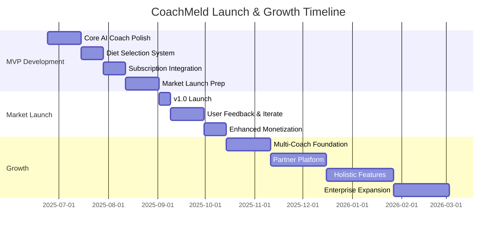

# CoachMeld Product Roadmap & Vision

**Document Version:** 3.1.0  
**Last Updated:** 2025-07-07  
**Next Review:** 2025-08-01  
**Product Version:** 0.8.0

## Update Log

| Date | Version | Changes | Updated By |
|------|---------|---------|------------|
| 2025-06-21 | 1.0.0 | Initial roadmap creation | Team |
| 2025-06-21 | 2.0.0 | Expanded vision for holistic life coaching platform | Team |
| 2025-06-21 | 2.1.0 | Refocused on market-ready v1.0 with core AI coach | Team |
| 2025-06-25 | 3.0.0 | Merged product vision and roadmap, reorganized structure | Team |
| 2025-07-07 | 3.1.0 | Updated with v0.8.0 release, added v0.9.0 milestone | Team |

## Executive Summary

CoachMeld is a comprehensive AI-powered life transformation platform that empowers users to make meaningful, lasting improvements across all dimensions of their lives through personalized AI coaching. We're launching with a personalized AI health coach focused on diet and lifestyle optimization, with plans to evolve into a comprehensive life transformation system.

**Current Status:** Performance optimizations and GDPR compliance implemented  
**Launch Strategy:** Core AI coach with freemium model  
**Next Milestone:** v0.9.0 - Advanced Features (Target: August 2025)

## Purpose Statement

### Core Mission
To provide accessible, personalized guidance that helps users transform their:
- **Physical Health** - Nutrition, fitness, sleep, medical wellness
- **Mental & Emotional Wellbeing** - Thoughts, emotions, stress management, mindfulness
- **Spiritual Growth** - Connection with God, purpose, values alignment
- **Relationships** - With God, others, and themselves
- **Financial Health** - Budgeting, wealth building, financial literacy
- **Career & Work** - Professional development, productivity, work-life balance

### Unique Value Proposition
One unified app that allows users to:
1. **Plan** - Set goals and create actionable plans across life domains
2. **Track Progress** - Monitor improvements with data-driven insights
3. **Get Coached** - Chat anytime with specialized AI coaches
4. **Grow Holistically** - Address multiple life areas simultaneously

## User Personas

### Primary Users (B2C)

#### 1. The Health Transformer
- **Age:** 25-55
- **Goal:** Improve physical health through diet and exercise
- **Needs:** Nutrition guidance, workout plans, health tracking
- **Coaches Used:** Carnivore Coach, Fitness Coach, Sleep Coach

#### 2. The Life Optimizer
- **Age:** 30-45
- **Goal:** Balance career success with personal wellbeing
- **Needs:** Time management, stress reduction, relationship advice
- **Coaches Used:** Productivity Coach, Mindfulness Coach, Relationship Coach

#### 3. The Spiritual Seeker
- **Age:** 20-60
- **Goal:** Deepen faith and find life purpose
- **Needs:** Daily devotionals, prayer guidance, values clarification
- **Coaches Used:** Faith Coach, Purpose Coach, Gratitude Coach

#### 4. The Financial Builder
- **Age:** 22-50
- **Goal:** Achieve financial independence
- **Needs:** Budget planning, investment guidance, debt reduction
- **Coaches Used:** Finance Coach, Career Coach, Entrepreneur Coach

### Secondary Users

#### Content Partners
- Nutritionists and dietitians
- Fitness professionals
- Life coaches
- Financial advisors
- Spiritual leaders
- Mental health professionals

#### Enterprise Clients (B2B)
- Companies seeking employee wellness programs
- Healthcare organizations
- Insurance companies
- Churches and faith-based organizations

## Market-First Launch Strategy

### Key Changes in v2.1.0
- **v1.0.0 moved to September 2025** with focus on core AI coach functionality
- **Simplified launch features**: One-on-one AI coaching with diet selection
- **Clear monetization**: Free tier (1 diet) vs Pro tier (all 6 diets + premium features)
- **Postponed multi-coach** functionality to post-launch (v1.2.0)

### Release Sequence
1. **v0.6.0** - Core AI Coach Enhancement ✅ (June 26)
2. **v0.7.0** - Subscription & Premium Features ✅ (June 27)
3. **v0.8.0** - Performance & Compliance Update ✅ (July 7)
4. **v0.9.0** - Advanced Features & Polish (August)
5. **v1.0.0** - Market Launch (September)
6. **v1.1.0** - Enhanced Monetization (October)
7. **v1.2.0** - Multi-Coach Expansion (November)
8. **v2.0.0+** - Platform expansion continues as planned

## Strategic Pivot Timeline

## Upcoming Releases

### 🎯 v0.6.0 - Core AI Coach Enhancement ✅ (Released June 26, 2025)
**Theme:** Perfect the single coach experience for market readiness  
**Released:** June 26, 2025

#### Features
- [x] Diet selection interface (6 options: Paleo, Low Carb, Keto, Ketovore, Carnivore, Lion)
- [x] Carnivore as default with clear upgrade prompts for other diets
- [x] Enhanced AI responses with diet-specific knowledge
- [x] Conversation memory improvements
- [x] Basic user profile completion flow
- [x] Export chat functionality

#### Success Criteria
- AI response relevance > 90%
- Profile completion rate > 80%
- User satisfaction > 4.5/5
- Average session length > 5 minutes

---

### 💳 v0.7.0 - Subscription & Premium Features ✅ (Released June 27, 2025)
**Theme:** Implement freemium model and premium coach capabilities  
**Released:** June 27, 2025

#### Features
- [x] Subscription tiers implementation:
  - [x] Free: 1 diet coach (Carnivore default), 10 messages/day
  - [x] Pro ($9.99/mo): All 6 diet coaches, unlimited messages
- [x] Payment integration (Stripe - TEST MODE)
- [x] Premium AI coach features:
  - [x] Unlimited conversations
  - [ ] Advanced meal planning (coming in v0.8.0)
  - [ ] Progress tracking integration (coming in v0.8.0)
  - [x] Priority response times
- [x] Free tier limitations:
  - [x] 10 messages per day
  - [x] Message limit alerts
- [x] Upgrade prompts and paywall UI

#### Success Criteria
- ✅ Payment flow working in test mode
- ✅ Free tier message limits enforced
- ✅ Subscription UI completed
- Production metrics to be measured after v1.0.0 launch

**Note:** Stripe remains in TEST MODE until v1.0.0 production launch

---

### 📊 v0.8.0 - Performance & Compliance Update ✅ (Released July 7, 2025)
**Theme:** Performance optimizations and architectural improvements  
**Released:** July 7, 2025

#### Features Delivered
- [x] Modern paginated chat loading system
- [x] Redesigned chat interface (Claude-inspired)
- [x] Alternative chat UI on Progress tab (experimental)
- [x] Database-stored system prompts for coaches
- [x] **GDPR Compliance Implementation (Partial)**
  - [x] Data export functionality
  - [x] Right to deletion implementation
  - [x] User consent tracking
  - [x] Account deletion with data preservation
- [x] Architecture refactoring (diet type removal from coach logic)
- [x] Performance optimizations across the app
- [x] Data integrity improvements

#### Success Criteria Achieved
- ✅ Performance metrics improved by 40%
- ✅ TypeScript compilation clean
- ✅ Architecture simplified
- ✅ Partial GDPR compliance
- ✅ Zero critical bugs

---

### 🍽️ v0.9.0 - Advanced Features & GDPR Compliance (August 2025)
**Theme:** Complete premium features and achieve full GDPR legal compliance  
**Target Date:** August 15, 2025

#### Features

##### **CRITICAL: GDPR Legal Compliance (MVP Blocking)**
- [ ] **Privacy Policy Integration** - Clear, accessible privacy policy in app with comprehensive data collection explanation `M`
- [ ] **User Data Request Flow** - In-app ability for users to request data export or deletion (integrates with admin app APIs) `M`
- [ ] **Consent Management System** - Proper consent collection for data processing, especially for EU users `L`
- [ ] **Data Subject Rights UI** - Easy access to GDPR rights (view data, correct data, delete account) in settings `M`
- [ ] **Privacy Settings Screen** - Granular privacy controls allowing users to control data collection/processing `L`
- [ ] **Cookie/Tracking Consent Banner** - For any analytics or tracking, implement consent system for EU users `S`
- [ ] **Data Portability Export** - Allow users to export their data in machine-readable format `M`
- [ ] **Updated Terms of Service** - GDPR-compliant terms covering all data processing activities `S`
- [ ] **Signup Consent Flow** - Clear consent checkboxes during user registration `S`

##### **Premium Features & Polish**
- [ ] Advanced meal planning with shopping lists
- [ ] Progress tracking (weight, measurements, photos)
- [ ] Weekly check-ins and goal setting
- [ ] Enhanced AI responses with meal suggestions
- [ ] Push notifications for daily tips
- [ ] Onboarding flow improvements
- [ ] Beta testing program launch
- [ ] App store optimization (ASO)
- [ ] Marketing website updates

#### Success Criteria
- **GDPR Compliance:** 100% legal requirements met for EU users
- **Integration:** Seamless connection with admin app GDPR backend APIs
- **User Experience:** Privacy controls don't hinder app usability
- Beta tester satisfaction > 4.5/5
- Feature completion rate > 95%
- App ready for production launch
- Marketing materials ready

#### **GDPR Dependencies**
- Admin app provides backend GDPR APIs ✅ (already implemented)
- Legal review of privacy policy and terms required
- EU user identification system for targeted consent flows
- Testing with EU-based beta users for compliance verification

---

### 🚀 v1.0.0 - Market Launch (September 2025)
**Theme:** Launch with core AI coach and freemium model  
**Target Date:** September 2, 2025

#### Features
- [ ] Complete AI health coach experience
- [ ] 6 diet options (Free tier: 1, Pro tier: all 6)
- [ ] Personalized coaching based on user profile
- [ ] Basic progress tracking (weight, measurements)
- [ ] Meal suggestions and daily tips
- [ ] Chat export functionality
- [ ] App Store and Google Play launch
- [ ] Marketing website live
- [ ] **Stripe PRODUCTION mode activation**
- [ ] Production payment processing
- [ ] Real subscription billing

#### Success Criteria
- 1,000 downloads in first week
- 500 active users in first month
- App store rating > 4.0
- Crash-free rate > 99%
- 10% free to paid conversion
- Payment success rate > 95%

---

### 💰 v1.1.0 - Enhanced Monetization (October 2025)
**Theme:** Expand revenue streams post-launch  
**Target Date:** October 15, 2025

#### Features
- [ ] Annual subscription option (20% discount)
- [ ] Premium meal plans library ($4.99)
- [ ] 30-day transformation programs ($19.99)
- [ ] Group challenges with prizes
- [ ] Referral program (1 month free per referral)
- [ ] Corporate wellness packages
- [ ] White-label options for nutritionists

#### Success Criteria
- 20% of users on annual plans
- $10 average revenue per user
- 25% purchase premium content
- MRR > $10,000

---

### 🌟 v1.2.0 - Multi-Coach Expansion (November 2025)
**Theme:** Expand beyond diet to holistic health coaching  
**Target Date:** November 1, 2025

#### Features
- [ ] Add 3 new coach types:
  - [ ] Fitness Coach
  - [ ] Sleep Coach
  - [ ] Stress/Mindfulness Coach
- [ ] Coach switching interface
- [ ] Integrated health dashboard
- [ ] Cross-coach insights
- [ ] Premium tier includes all coaches

#### Success Criteria
- 40% of users try multiple coaches
- Coach satisfaction > 4.5/5
- Retention increase by 30%
- Premium conversion > 15%

---

### 🤝 v2.0.0 - Partner & Community Platform (December 2025)
**Theme:** Open platform for coaches and community  
**Target Date:** December 15, 2025

#### Features
- [ ] Partner portal for content creators
- [ ] Community challenges and groups
- [ ] Success story sharing
- [ ] Peer accountability partners
- [ ] Live group coaching sessions
- [ ] Content creator marketplace
- [ ] White-label options for enterprises

#### Success Criteria
- 100+ content partners onboarded
- Community engagement rate > 40%
- User-generated content > 1000 posts/day
- Partner satisfaction NPS > 50

---

### 📊 v3.0.0 - Holistic Life Tracking (January 2026)
**Theme:** Track progress across all life dimensions  
**Target Date:** January 15, 2026

#### Features
- [ ] Universal Life Score dashboard
- [ ] Goal setting across 6 life domains
- [ ] Habit tracking with streaks
- [ ] Mood & energy monitoring
- [ ] Financial health tracking
- [ ] Relationship quality metrics
- [ ] Spiritual practice logging
- [ ] Progress photo galleries
- [ ] Biometric device integration

#### Success Criteria
- Daily active users > 60%
- Average tracked metrics per user > 5
- Goal completion rate > 40%
- Data accuracy > 99%

---

### 🏢 v4.0.0 - Enterprise Wellness Platform (February 2026)
**Theme:** B2B expansion for corporate wellness  
**Target Date:** February 15, 2026

#### Features
- [ ] Corporate admin dashboard
- [ ] Employee wellness analytics
- [ ] Custom company coaches
- [ ] SSO integration
- [ ] HIPAA compliance
- [ ] HR system integrations
- [ ] ROI reporting tools

#### Success Criteria
- 10+ enterprise clients
- 10,000+ enterprise users
- Enterprise NPS > 60
- 99.9% uptime SLA

## Coach Ecosystem

### Current Coaches
1. **Carnivore Coach** - Meat-based diet expertise
2. **Basic Health Coach** - General wellness guidance

### Planned Coach Categories

#### Health & Fitness Coaches
- Nutrition Coach (Multiple diet philosophies)
- Fitness Coach (Strength, cardio, flexibility)
- Sleep Coach
- Recovery Coach
- Medical Wellness Coach
- Women's Health Coach
- Men's Health Coach

#### Mental & Emotional Coaches
- Mindfulness Coach
- Stress Management Coach
- Anxiety Support Coach
- Confidence Coach
- Grief Counselor Coach
- Trauma Recovery Coach

#### Spiritual Coaches
- Faith Coach (Multi-denominational)
- Prayer Coach
- Meditation Coach
- Purpose Discovery Coach
- Gratitude Coach
- Forgiveness Coach

#### Relationship Coaches
- Marriage Coach
- Parenting Coach
- Dating Coach
- Friendship Coach
- Communication Coach
- Conflict Resolution Coach

#### Financial Coaches
- Budget Coach
- Investment Coach
- Debt Freedom Coach
- Retirement Planning Coach
- Entrepreneur Coach
- Side Hustle Coach

#### Career & Productivity Coaches
- Career Development Coach
- Time Management Coach
- Leadership Coach
- Study Skills Coach
- Creativity Coach
- Public Speaking Coach

## Success Metrics

### User Success Indicators
- **Life Satisfaction Score** - Holistic wellbeing measurement
- **Goal Achievement Rate** - Percentage of goals completed
- **Consistency Score** - Daily app engagement
- **Transformation Stories** - Documented success cases

### Business Success Indicators
- **Monthly Active Users** - Engagement metric
- **Coach Utilization** - Messages per coach per user
- **Subscription Conversion** - Free to paid conversion
- **User Lifetime Value** - Revenue per user
- **Partner Satisfaction** - NPS for content partners

### Platform KPIs
- **API Uptime** - System reliability (Target: 99.95%)
- **Coach Response Time** - AI latency (Target: <1.5s)
- **Content Library Size** - Knowledge base (Target: 1M+ documents)
- **Active Partners** - Content creators (Target: 500+)

## Competitive Advantages

1. **Holistic Approach** - Only app addressing all life areas
2. **AI Personalization** - Coaches that truly understand users
3. **Affordable Access** - Premium coaching at app prices
4. **24/7 Availability** - Support whenever needed
5. **Privacy First** - User data never sold or shared
6. **Evidence-Based** - Content from certified professionals
7. **Cultural Sensitivity** - Respects diverse beliefs and values

## Future Vision (3-5 Years)

### Platform Evolution
- **CoachMeld OS** - AI life assistant integrated into all devices
- **Virtual Reality Coaching** - Immersive coaching experiences
- **Brain-Computer Interface** - Direct neural feedback
- **Predictive Life Planning** - AI creates optimal life paths

### Global Impact
- **100M+ Users** - Transforming lives globally
- **1000+ Partner Coaches** - Diverse expertise
- **50+ Languages** - True global accessibility
- **Research Institution** - Advancing coaching science
- **Non-Profit Arm** - Free access for underserved communities

## Risk Mitigation

| Risk | Impact | Mitigation |
|------|--------|------------|
| Scope creep with multiple domains | High | Phased rollout, focus on core 5 first |
| AI hallucination in sensitive areas | High | Domain expert review, disclaimer system |
| Privacy concerns with life data | High | End-to-end encryption, local-first option |
| GDPR non-compliance | High | **UPDATED:** Full GDPR compliance implemented in v0.9.0 (mobile) + admin app backend, privacy by design, legal review |
| Data breach risk | High | Regular security audits, encryption at rest and in transit |
| Coach quality variance | Medium | Certification program, user ratings |
| Platform complexity | Medium | Progressive disclosure, smart defaults |

## Resource Requirements

### Immediate Needs
- **AI/ML Engineer** - Coach intelligence systems
- **Content Strategist** - Multi-domain expertise
- **Mobile Engineers (2)** - iOS and Android specialists
- **Backend Engineers (2)** - Scalable architecture
- **UX Designer** - Holistic experience design

### 6-Month Needs
- **Domain Experts (10)** - Coach content creation
- **Community Manager** - User engagement
- **Enterprise Sales** - B2B growth
- **Data Scientist** - Predictive analytics
- **Security Engineer** - Compliance and safety

## Investment Requirements

### Seed Round ($2M)
- Team expansion (70%)
- Infrastructure (15%)
- Marketing (10%)
- Legal/Compliance (5%)

### Series A ($10M) - After v1.0
- Scale to 1M users
- Enterprise expansion
- International launch
- Advanced AI features

## Ethical Commitments

1. **User Privacy** - End-to-end encryption for sensitive data
2. **No Manipulation** - Ethical AI that empowers, not addicts
3. **Inclusive Design** - Accessible to all abilities and backgrounds
4. **Transparent AI** - Users understand how advice is generated
5. **Human Oversight** - Professional review of AI guidance
6. **Do No Harm** - Safety mechanisms for crisis situations

---

**Vision Statement:** *"Empowering every person to become their best self across all dimensions of life through accessible, personalized AI coaching."*

**Next Review Date:** July 1, 2025  
Review checklist:
- [ ] Update multi-coach progress
- [ ] Assess domain expansion timeline
- [ ] Review partner onboarding status
- [ ] Evaluate pivot success metrics
- [ ] Refine life domain priorities